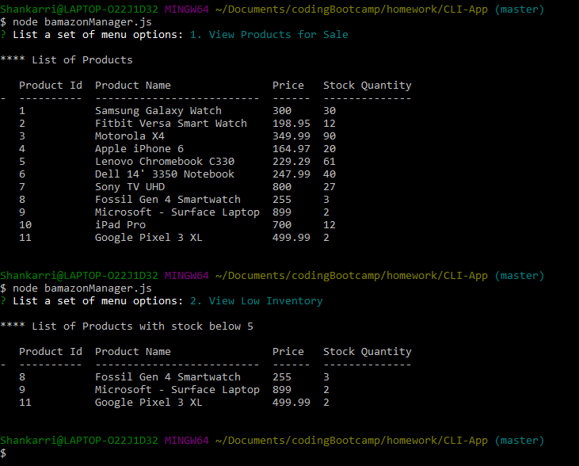
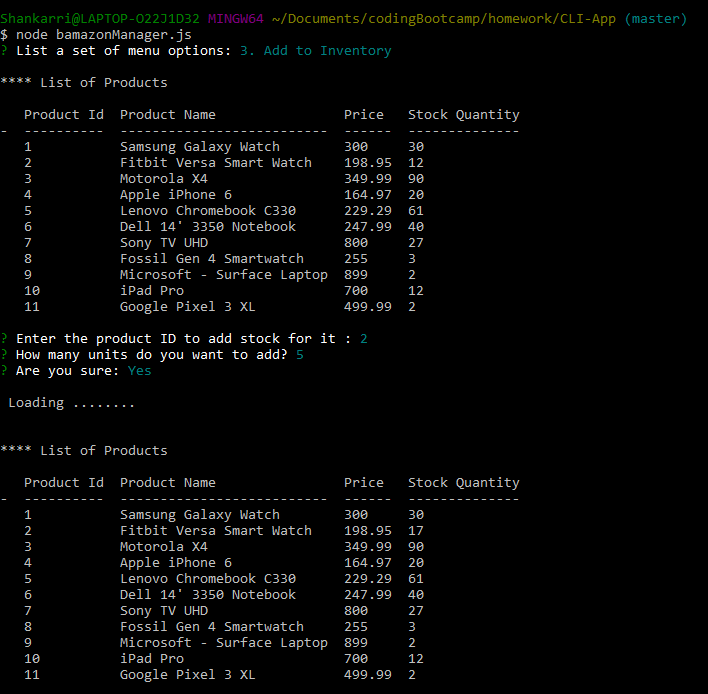
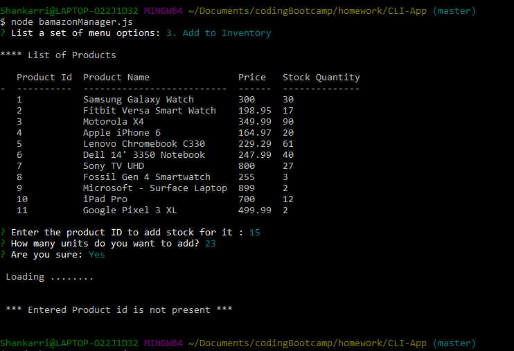
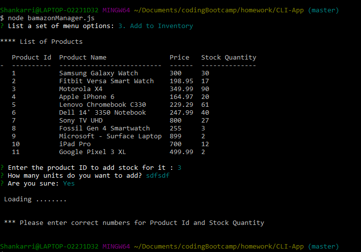
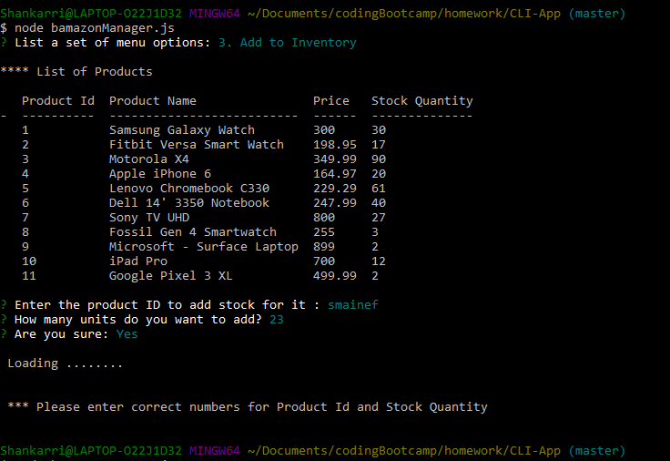
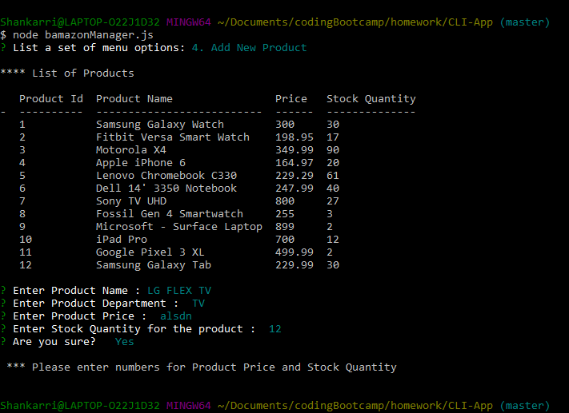
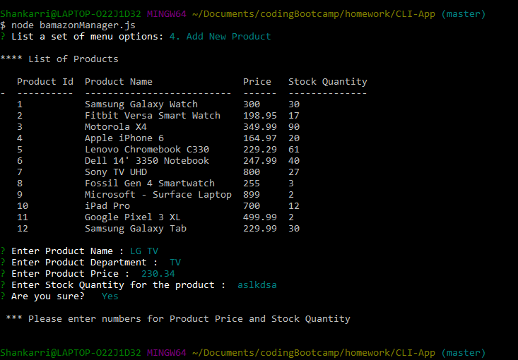

# CLI-App

*  CLI App will be a command line node app which will allow customers to view the products avaialble in the bamazon and also place an order for any available products

* This product also allows Managers 
    1. View Products for Sale
    2. View Low Inventory
    3. Add to Inventory
    4. Add New Product
________________________________________
 
 ## Initial setup

 * Clone the files to your system

 * Copy all the sql commands from the "bamazon.sql" and run it in your mysql database to run this application.

 * You have to also change the port settings in your file to match your mysql database.

 * Go to your terminal and enter below commands to install all the dependent packages

```
* npm install mysql
* npm install inquirer
* npm install console.table
```
________________________________________

## Customer View

* Command --  node bamazonCustomer

* Once the command is entered, all the products that are available in the bamazon will be displayed.

* Enter the product Id from the displyed Products list and number of units that you need.

* If you do not want to continue, then press No. This will exit the application.

* Screenshot : 


* If you want to continue, then press Yes or Y. This will  place an order in the bamazon and your Total Cost of the purchase will be displayed in the terminal. 

* Screenshot : 


* If number of units of the selected product is not in stock then it will display Insufficient quantity message.

* Screenshot: 


________________________________________

### Error Scenario's:


1. If the user entered Product Id is not present in bamazon, then display error message.

* Screenshot : 


2. If the user entered Product Id or Number of items are not correct, then display error message.

* Screenshot :
 
 

________________________________________

________________________________________

## Manager View

* Command --  node bamazonCustomer

* Once the command is entered, you will see a List a set of menu options:

    1. View Products for Sale
    2. View Low Inventory
    3. Add to Inventory
    4. Add New Product

#### View Products for Sale & View Low Inventory

 
* Move the arrow keys to select from one of the options. 

* If you select the first option, then you see the all the products that are available in bamazon.

* If you select the second option, then you see the all the products that has stock quantity less than 5 available in bamazon.

* Screenshot for first and second option: 



#### Add to Inventory

* If you select third option, then terminal will first display all the prodcusts that are available in the bamazon. Then you will be asked for product Id and number of stocks to add.

* After entring the correct details and If you want to continue, then press Yes or Y. Stock will be added to the entered product ID. 

* Screenshot : 


________________________________________

### Error Scenario's:


1. If the user entered Product Id is not present in bamazon, then display error message.

* Screenshot : 


2. If the user entered Product Id or Number of items are not correct, then display error message.

* Screenshot :
 
 

________________________________________

#### Add New product

* If you select fourth option, then terminal will first display all the Exsisting prodcusts that are available in the bamazon. 

* Then you will be asked for to details for the new Product like Name, Department, price and Stock.

* After entring the correct details and If you want to continue, then press Yes or Y. Stock will be added to the entered product ID. 

* Screenshot : 


________________________________________

### Error Scenario's:


1. If the user entered Product Price or Stock are not correct, then display error message.

* Screenshot :
 
 

________________________________________
